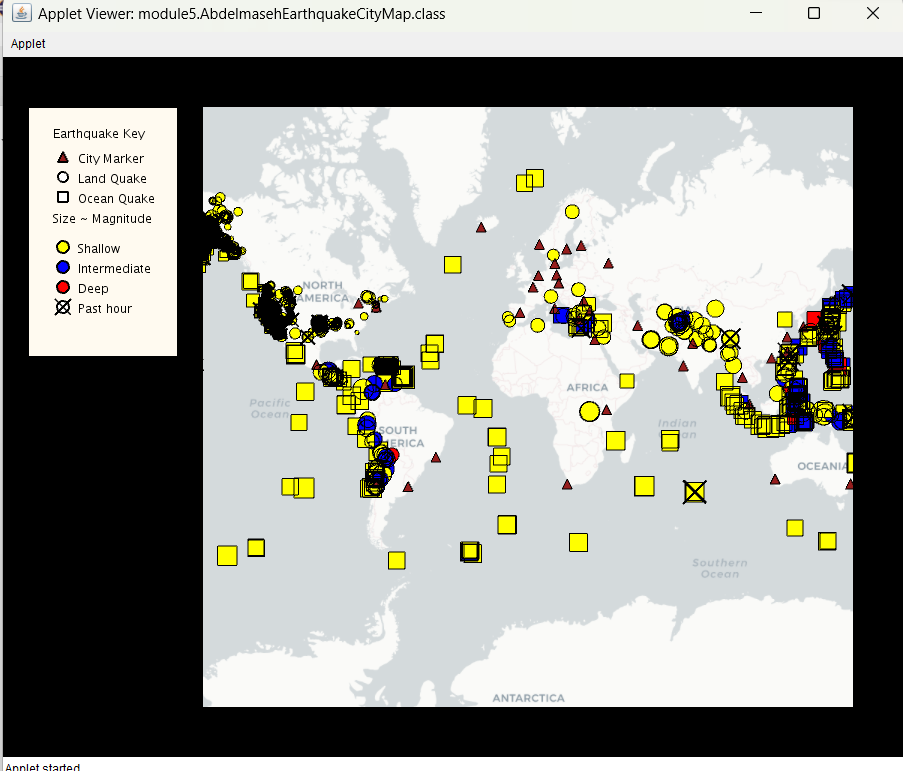
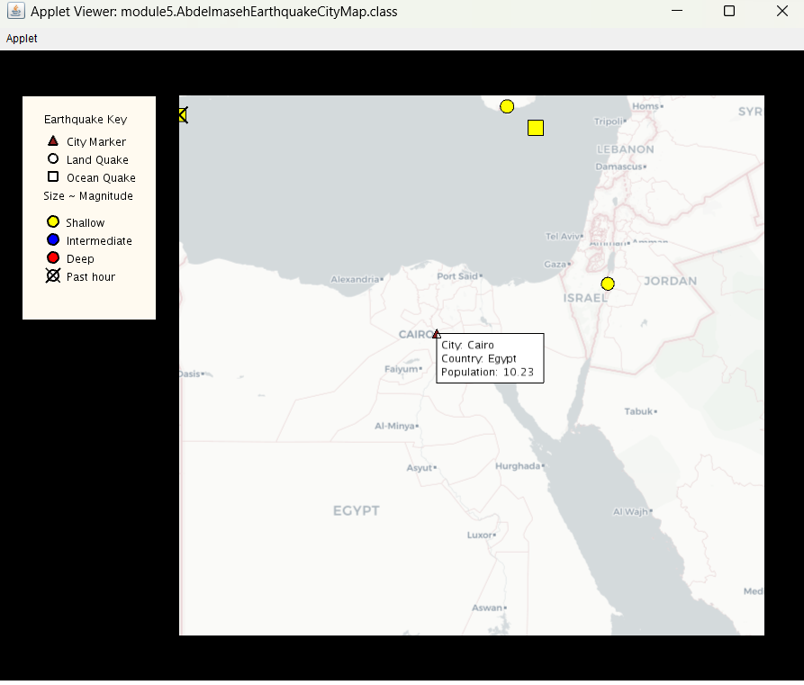
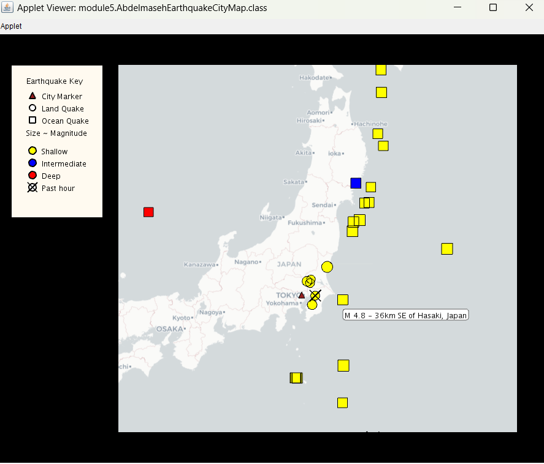
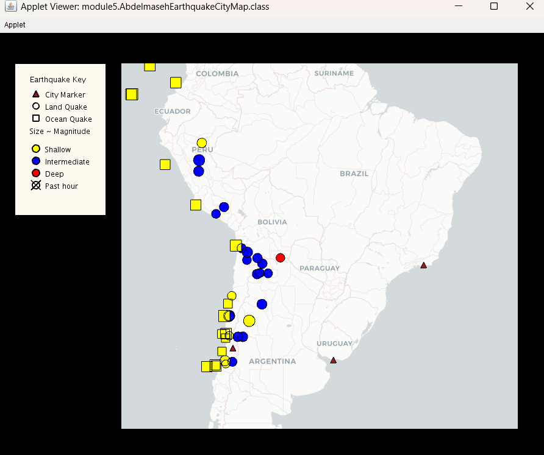
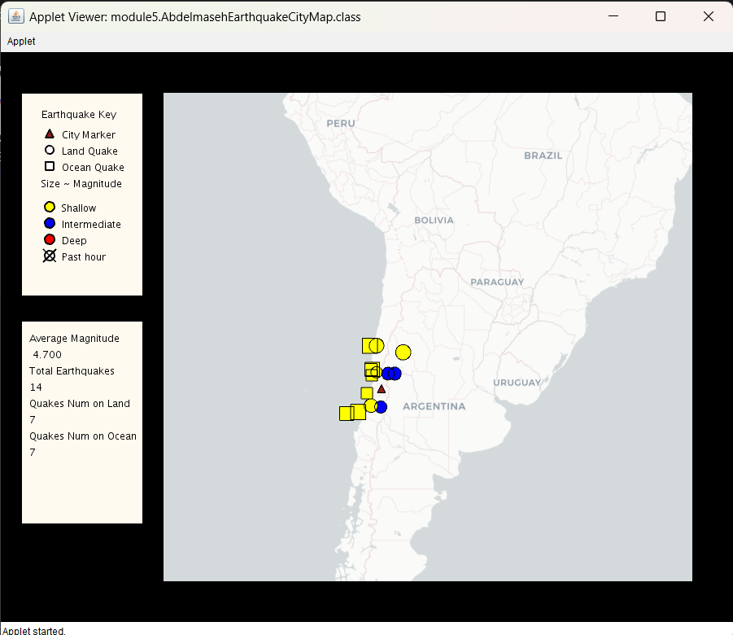
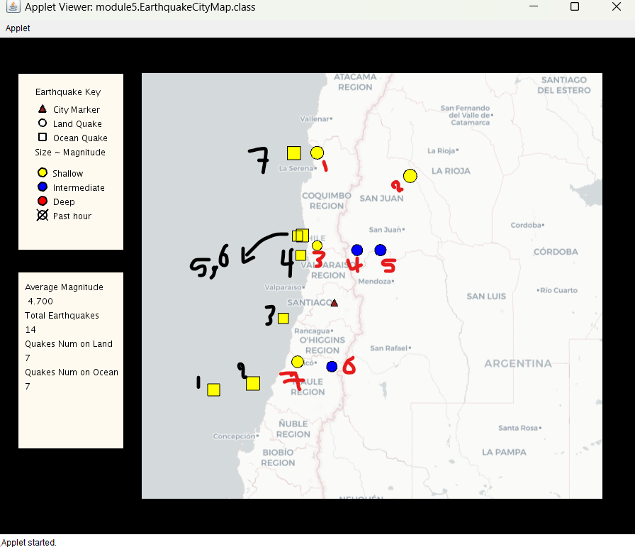
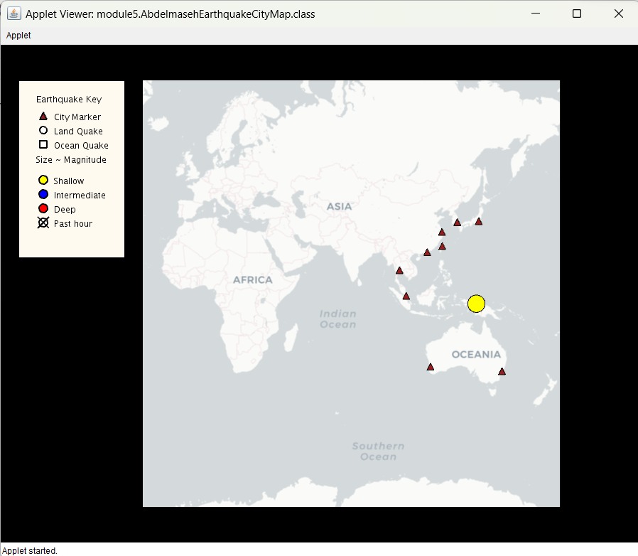

# I am happy to share my earthquake data visualizer using Java 8, Processing library with version 1.8, and Unfolding Map (library) v0.9.7 (UCSD edition).

## This project is part of the third course from the Object Oriented Programming in Java Specialization on coursera
# NOTE: What I am going to say Is implemented in module5.

# Project goals
    The goal of the project is to practice and focus on applying the four OOP concepts abstraction, encapsulation, Inheritance, and Polymorphism (dynamic polymorphism using method overriding and static polymorphism using method overloading).

# Project Functionalities
* shows earthquake data from a live RSS feed on the map
    * At this part, multiple types of markers are drawn on the map
        * city markers
        * earthquake markers
            * whether these earthquakes have happened on 
                * land 
                * oceans.
            * It also shows whether these earthquakes are 
                * Shallow
                * Intermediate
                * Deep.

  
	
* When the mouse hovers over a marker it displays a box
	* If the marker is a city this box shows the city’s name, country, and population.
      

	* If the marker is an earthquake it displays the title of the earthquake including its magnitude and region.
      

* When the mouse is clicked we have two possibilities
	* A click on a city marker
        * will make that marker will be displayed and the earthquakes that includes it in their threat circle.
        * All other Markers are hidden.
        * new GUI section is added at the bottom left corner on the GUI this section shows.
            * The Average magnitude of the earthquakes affect this city.
            * Total number of the earthquakes affect it.
            * The number of land earthquakes.
            * the number of ocean earthquakes.
    
    * This Photo shows when no city is clicked.
      

    * When Santiago city is clicked.
      

    * A deeper look to ensure the counts of the earthquakes type.
      

	* After clicking on an earthquake marker, only cities potentially affected by that earthquake (cities that are in its threatCircle) and this earthquake will be displayed.
      

# unfolding_app_template and UC San Diego/Coursera MOOC starter code
This is a skeleton to use Unfolding in Eclipse as well as some starter
code for the Object Oriented Programming in Java course offered by 
UC San Diego through Coursera.

A very basic Unfolding demo you'll find in the source folder in the default package. 
For more examples visit http://unfoldingmaps.org, or download the template with
examples.

The module folders contain the starter code for the programming assignments
associated with the MOOC.

Get excited and make things!

INSTALLATION

Import this folder in Eclipse ('File' -> 'Import' -> 'Existing Projects into
Workspace', Select this folder, 'Finish')

MANUAL INSTALLATION

If the import does not work follow the steps below.

- Create new Java project
- Copy+Paste all files into project
- Add all lib/*.jars to build path
- Set native library location for jogl.jar. Choose appropriate folder for your OS.
- Add data/ as src

TROUBLE SHOOTING

Switch Java Compiler to 1.6 if you get VM problems. (Processing should work with Java 1.6, and 1.7)