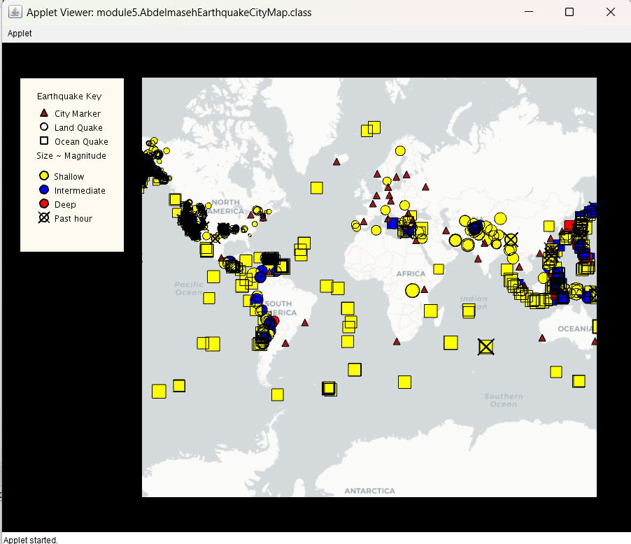

# 🌍 Earthquake Data Visualizer Project 🌍

I am thrilled to share my latest project, the Earthquake Data Visualizer, which I developed using Java 8, the Processing library (version 1.8), and the Unfolding Map library (v0.9.7 - UCSD edition).

🎓 This project is a significant part of my journey through the Object-Oriented Programming in Java Specialization on Coursera, specifically implemented in module 5.

### 🎯 Project Goals:

The primary objective of this project was to sharpen my skills in applying the four fundamental Object-Oriented Programming (OOP) concepts: abstraction, encapsulation, inheritance, and polymorphism. I explored dynamic polymorphism through method overriding and static polymorphism through method overloading.

### 🚀 Project Functionalities:

Here are some of the key features and functionalities of the Earthquake Data Visualizer:

1- Displaying different markers on the map, including city markers and earthquake markers.

2- Real-time visualization of earthquake data from an RSS feed on the map.

3- Smart marker differentiation is based on various criteria such as location (land or ocean) and depth (shallow, intermediate, deep).

4- Informative pop-up boxes that appear when you hover over a marker, providing relevant details about cities and earthquakes.

5- Interactive clicking behavior: When clicking on a city marker, it reveals the earthquake threat analysis for that city, including average magnitude, total earthquake count, and the distribution of land and ocean earthquakes.

6- Focused earthquake analysis: Clicking on an earthquake marker displays the cities potentially affected by that earthquake.

# This video shows the functionality of the project.

The module folders contain the starter code for the programming assignments
associated with the MOOC.

Get excited and make things!

INSTALLATION

Import this folder in Eclipse ('File' -> 'Import' -> 'Existing Projects into
Workspace', Select this folder, 'Finish')

MANUAL INSTALLATION

If the import does not work follow the steps below.

- Create new Java project
- Copy+Paste all files into project
- Add all lib/*.jars to build path
- Set native library location for jogl.jar. Choose appropriate folder for your OS.
- Add data/ as src

TROUBLE SHOOTING

Switch Java Compiler to 1.6 if you get VM problems. (Processing should work with Java 1.6, and 1.7)